# Experimental: ServiceNow Workflow Integration

This document describes an experimental way to integrate `nss-quarry` into a ServiceNow-based support workflow.

Goal:
- a user opens an incident or request in ServiceNow
- the user uploads a `.pcap` or `.pcapng`
- the support team presses a button or runs a flow
- ServiceNow sends the capture to `nss-quarry`
- `nss-quarry` derives the capture window and IPs
- ServiceNow runs the correlated log search
- the case is updated with a support-friendly summary and optional CSV evidence

This is possible today with the current `nss-quarry` API. It is a good enterprise idea if it is implemented as a controlled backend workflow, not as a direct browser-to-internal-tool shortcut.

## Recommendation

Recommended posture for enterprise:
- keep `nss-quarry` private and internal
- integrate through a ServiceNow MID Server or another private integration worker
- use a dedicated least-privilege `nss-quarry` API token
- do not use an `admin` account for this workflow
- keep PCAP upload, search, and summary generation server-side
- write only the support-relevant summary back to the case by default

Recommended `nss-quarry` role for the ServiceNow integration token:
- `analyst`

Why `analyst`:
- it can run `/api/pcap/analyze`
- it can run `/api/search` and `/api/export/csv`
- it avoids the admin surface
- unlike `helpdesk`, it is not subject to helpdesk masking

## Why This Makes Sense

This workflow maps well to helpdesk and operations use cases:
- users already know how to open a case and attach a capture
- support teams do not need shell access to the log platform
- PCAP correlation becomes repeatable and auditable
- `nss-quarry` already provides the two key building blocks:
  - PCAP analysis: `/api/pcap/analyze`
  - correlated search: `/api/search`

Operationally, this is strongest when ServiceNow acts as the case system and `nss-quarry` acts as the investigation engine.

## Enterprise Fit

This is a good enterprise pattern if you keep the boundaries clear.

Good idea:
- ServiceNow stores the case and attachment
- a backend workflow calls `nss-quarry`
- the result is written back as structured case data, work notes, and optional evidence attachment

Bad idea:
- exposing `nss-quarry` broadly to the internet just so ServiceNow cloud can reach it
- using an admin session for automation
- returning full raw log dumps into case comments by default
- letting end users drive unrestricted searches

## Recommended Architecture

Use one of these patterns:

1. Preferred for private environments:
- ServiceNow Flow Designer or scripted action
- outbound REST through a MID Server
- `nss-quarry` stays private on internal HTTPS

2. Acceptable for smaller environments:
- ServiceNow outbound REST directly to `nss-quarry`
- only if `nss-quarry` is already published on a tightly controlled internal HTTPS endpoint reachable from ServiceNow

3. Not recommended:
- making `nss-quarry` public just for this workflow

## High-Level Flow

```mermaid
flowchart LR
    A["User opens incident in ServiceNow"] --> B["User uploads .pcap or .pcapng attachment"]
    B --> C["Support clicks Analyze NSS Evidence"]
    C --> D["ServiceNow Flow or UI Action starts backend workflow"]
    D --> E["MID Server or private integration worker authenticates to nss-quarry"]
    E --> F["ServiceNow retrieves attachment content"]
    F --> G["POST /api/pcap/analyze to nss-quarry"]
    G --> H["Receive padded time window plus source and destination IPs"]
    H --> I["POST /api/search with time window and IP filters"]
    I --> J["Optional POST /api/export/csv"]
    I --> K["ServiceNow builds support summary"]
    K --> L["Work notes and case fields updated"]
    J --> M["CSV evidence attached to case"]
    L --> N["Support reviews and continues troubleshooting"]
    M --> N
```



## Suggested Detailed Flow

### Step 1: User opens case

Suggested required case inputs:
- impacted user
- date/time of issue
- short symptom description
- whether a packet capture is attached

### Step 2: User uploads `.pcap` or `.pcapng`

Store the file as a normal ServiceNow attachment.

Notes:
- `nss-quarry` supports `.pcap` and `.pcapng`
- `nss-quarry` currently accepts uploads up to `5 GiB`
- ServiceNow attachment limits may be lower than `nss-quarry` limits and must be planned around

ServiceNow documentation indicates:
- the Attachment API supports upload and retrieval of attachments
- attachment size is governed by instance properties such as `com.glide.attachment.max_size`
- default limits may be much smaller than `5 GiB`

That means this integration is feasible, but large captures may need:
- ServiceNow attachment size tuning
- a separate large-file handling process
- or a policy telling users to upload only focused captures

## Step 3: Support triggers analysis

Implementation options:
- UI Action button on Incident / Case
- Flow Designer action
- Scripted REST or server-side script using RESTMessageV2

If the environment uses Flow Designer, ServiceNow documents that the REST step is available through IntegrationHub rather than the base platform.

## Step 4: ServiceNow authenticates to `nss-quarry`

Recommended:
- generate a dedicated API token in `nss-quarry`, for example for `svc_servicenow_analyst`
- assign role `analyst`
- store the token in ServiceNow credential storage / connection alias / secret store
- authenticate over HTTPS
- send `Authorization: Bearer <token>`
- set `allowed_sources` to the MID Server egress IP or the private integration worker subnet

Why API tokens are better here:
- OIDC is ideal for interactive human login
- this specific use case is backend automation
- API tokens are simpler and more deterministic than session-cookie login
- they avoid building a login-and-cookie workflow inside the integration

## Step 5: Send the PCAP to `nss-quarry`

ServiceNow uploads the attachment content to:
- `POST /api/pcap/analyze`

Returned fields include:
- `time_from`
- `time_to`
- `search_time_from`
- `search_time_to`
- `source_ips`
- `destination_ips`
- `packet_count`
- `link_type`

This is already enough to drive a correlated NSS search.

## Step 6: Run correlated search

ServiceNow then calls:
- `POST /api/search`

Recommended search inputs from the PCAP result:
- `time_from = search_time_from`
- `time_to = search_time_to`
- `filters.server_ip = comma-separated destination_ips`
- `filters.source_ip = comma-separated source_ips`

Recommended result columns:
- `time`
- `action`
- `respcode`
- `reason`
- `cip`
- `sip`
- `url`
- `urlcat`
- `appname`
- `devicehostname`
- `dept`

Optional:
- call `POST /api/export/csv` with the same payload and attach the CSV back to the case

## Step 7: Build a case summary

`nss-quarry` does not currently return a single dedicated “case summary” object. That is fine for an experimental integration, because ServiceNow can build the summary from existing API responses.

Suggested summary fields:
- capture start / end time
- padded search window used
- unique source IP count
- unique destination IP count
- top destination IPs
- top response codes
- blocked event count
- events with `respsize = 0` if you include that field in the search
- top policy reasons
- likely SSL/TLS issue indicators
- likely geo issue indicators from country fields

Suggested work-note template:

```text
NSS correlation summary

- Capture window: 2026-04-04 18:00:22Z to 2026-04-04 18:06:03Z
- Search window used: 2026-04-04 17:55:22Z to 2026-04-04 18:11:03Z
- Unique source IPs: 1
- Unique destination IPs: 14
- Matching NSS rows: 126
- Blocked rows: 18
- Top response codes: 200, 403, 204
- Top reasons: Not allowed to browse this category, Access denied due to bad server certificate
- Possible issue class: policy block and SSL certificate validation
```

## Support-Friendly Outcome

The support analyst should not need to manually interpret hundreds of raw rows first.

The workflow should ideally produce:
- a short human summary in work notes
- a link to the relevant `nss-quarry` search view
- an optional CSV attachment
- a visible indicator of likely issue type

Suggested issue buckets:
- policy block
- SSL/TLS certificate or handshake issue
- geo block / country issue
- connectivity with no response payload
- suspicious or threat-related block

## Security Guardrails

This is the part that matters most for enterprise use.

### Network

- Keep `nss-quarry` on private HTTPS.
- Prefer MID Server or another internal integration runner instead of public exposure.
- Restrict source IPs allowed to reach `nss-quarry`.

### Identity

- Use a dedicated API token for ServiceNow automation.
- Use `analyst`, not `admin`.
- Rotate the token and store it in ServiceNow credential storage.

### Scope control

- Use bounded time windows only.
- Use PCAP-derived IP filters when possible.
- Do not let the workflow run open-ended searches across all 14 days.

### Data handling

- Keep raw PCAP retention governed by ServiceNow policy, not copied into multiple places.
- `nss-quarry` already streams the upload to a private temp file and removes it after analysis.
- Prefer writing a summary back to the case, not a full raw row dump.

### Audit

- `nss-quarry` already audits login, PCAP analysis, search, export, and admin actions.
- Keep ServiceNow case updates and `nss-quarry` audit events correlated by case number when you implement the workflow.

## Practical Constraints

### 1. ServiceNow attachment size

This is the first real constraint.

`nss-quarry` supports up to `5 GiB` uploads, but ServiceNow attachment size may be smaller by default. If your support team regularly handles large captures, validate this early.

### 2. Non-interactive auth model

`nss-quarry` supports API-token auth for automation clients, which is the recommended choice for ServiceNow integrations.

### 3. Summary generation

There is no dedicated `case summary` endpoint yet. For now, ServiceNow should construct the summary from:
- `/api/pcap/analyze`
- `/api/search`
- optionally `/api/export/csv`

## Recommended Next-Step Product Enhancements

If this experimental workflow becomes important, the next features worth adding to `nss-quarry` are:

1. A dedicated summary endpoint
- for example `/api/pcap/assist-summary`
- input: PCAP upload or prior PCAP-analysis result
- output: structured support summary, top findings, and issue classification

2. Case correlation metadata
- optional custom field in audit metadata such as `case_id` or `ticket_number`

3. Prebuilt ServiceNow payload mode
- response shaped specifically for case comments, work notes, and attachments

## Verdict

Yes, this is possible today.

Yes, it can be a good enterprise idea.

But only if you implement it as:
- private backend integration
- least-privilege API token
- bounded PCAP-driven searches
- summary-first case updates

It is not a good idea if the integration requires broad public exposure of `nss-quarry` or uses admin privileges for routine case handling.

## External References

Relevant ServiceNow product documentation:
- REST step / Flow Designer: <https://www.servicenow.com/docs/bundle/zurich-integrate-applications/page/administer/flow-designer/reference/rest-request-action-designer.html>
- Outbound REST web service: <https://www.servicenow.com/docs/en-US/bundle/zurich-api-reference/page/integrate/outbound-rest/concept/c_OutboundRESTWebService.html>
- Outbound REST through MID Server: <https://www.servicenow.com/docs/en-US/bundle/zurich-api-reference/page/integrate/outbound-rest/concept/c_OutboundRESTMIDServerSupport.html>
- Attachment API: <https://www.servicenow.com/docs/en-US/bundle/zurich-api-reference/page/integrate/inbound-rest/concept/c_AttachmentAPI.html>

## Related Project Docs

- Main guide: [README.md](/Users/roman/codex/nss-quarry/README.md)
- API reference: [docs/api.md](/Users/roman/codex/nss-quarry/docs/api.md)
- OIDC guide: [docs/oidc-setup.md](/Users/roman/codex/nss-quarry/docs/oidc-setup.md)
